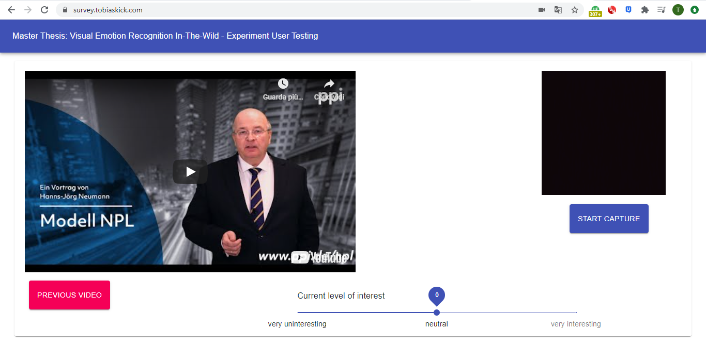

# User Experiment - Interest identification with emotion recognition (ER)
[Web Development] Web application created with ReactJS for a user experiment conducted during my Master's thesis @ University of Hamburg

  

## Goal: 
Creation of a frontend web application that shows users different ads and records their webcam stream only when the video is playing.

## Tasks:
• Implementation of a web-application with all its elements, like the header and video 
• Writing functionality that handles the user input, as well as the slider and buttons 
• Hosting of the web application on experiment.tobiaskick.com 

## Outcome: 
By capturing a user's emotion in real-time on the developed website, I could identify subjective interest with emotion recognition based interest.

## Live Demo - [Click Here](https://survey.tobiaskick.com)
1. Allow access to the Webcam
2. Click the 'Start Capture' button to start the video, log the Webcam frame and to log the interest indicted by the slider
3. Watch the video and indicate your interest through the slider (from -5 to +5)
4. Click 'Pause Capture' to make the 'Download results' button and the 'Restart experiment' button appear
5. Click on 'Next Video' to change to the next video in the playlist

## Tools & Resources:
• ReactJS, HTML, CSS  
• [Create a New React App](https://reactjs.org/docs/create-a-new-react-app.html) - Get started with React here 
• [Material-UI](https://material-ui.com/) - React components for faster and easier web development 
• [TensorFlow.js](https://www.tensorflow.org/js) - A library for machine learning in Javascript 
• [React Webcam](https://www.npmjs.com/package/react-webcam) - Webcam component for React 
• [React Youtube](https://www.npmjs.com/package/react-youtube) - YouTube component for React 

## References:
• https://github.com/amogh-w/React-Tensorflow-Object-Detection

## Available Scripts:
In the project directory, you can run: `npm start`
Open [http://localhost:3000](http://localhost:3000) to view it in the browser.
---
This project was bootstrapped with [Create React App](https://github.com/facebook/create-react-app).
